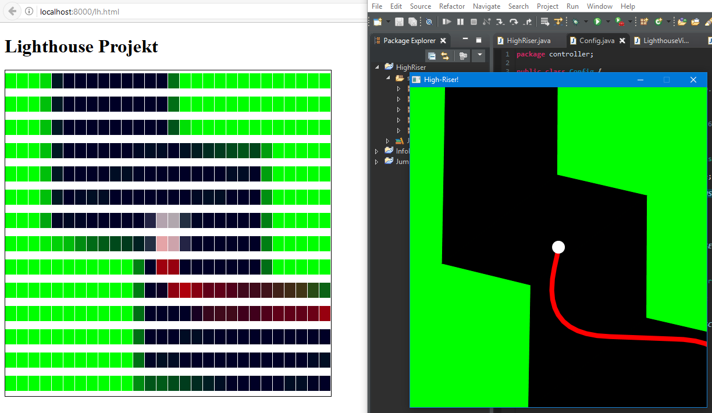
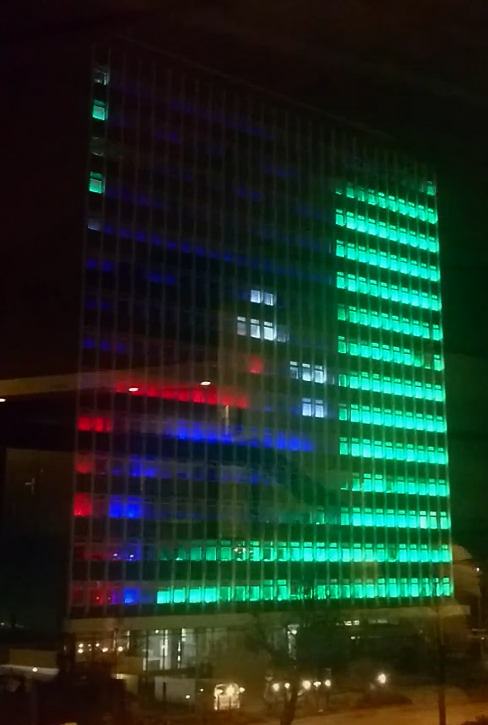
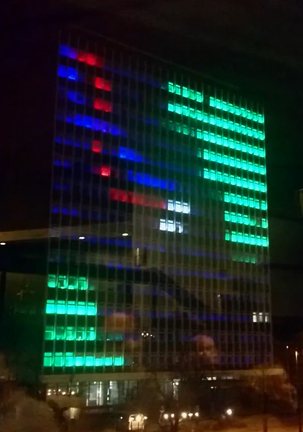

A simple game written in Java for either one or two players designed to be playable on the [high-riser display of CAU Kiel](http://www.uni-kiel.de/download/lighthouse/project-lighthouse.pdf).

## Download

[Runnable Jar File](https://github.com/tim-we/high-riser/releases/download/v1.1/highriser-v1.1.jar)

# Controls

 - Player 1: `SPACE` (red)
 - Player 2: `ARROW UP` (blue)

# Media

[Video](https://www.instagram.com/p/BReTM5pDlHj/)

(desktop view & lighthouse view)

